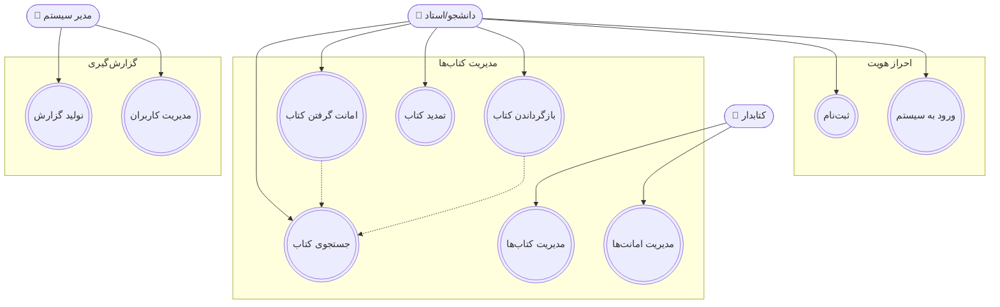
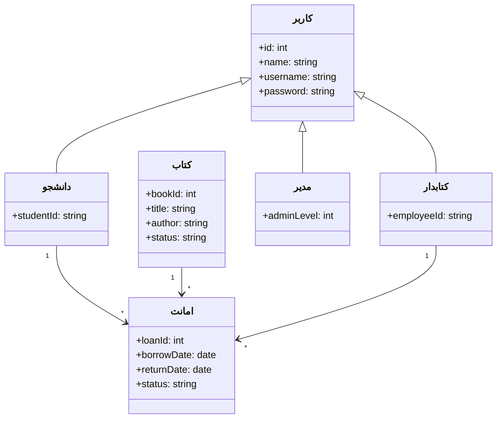
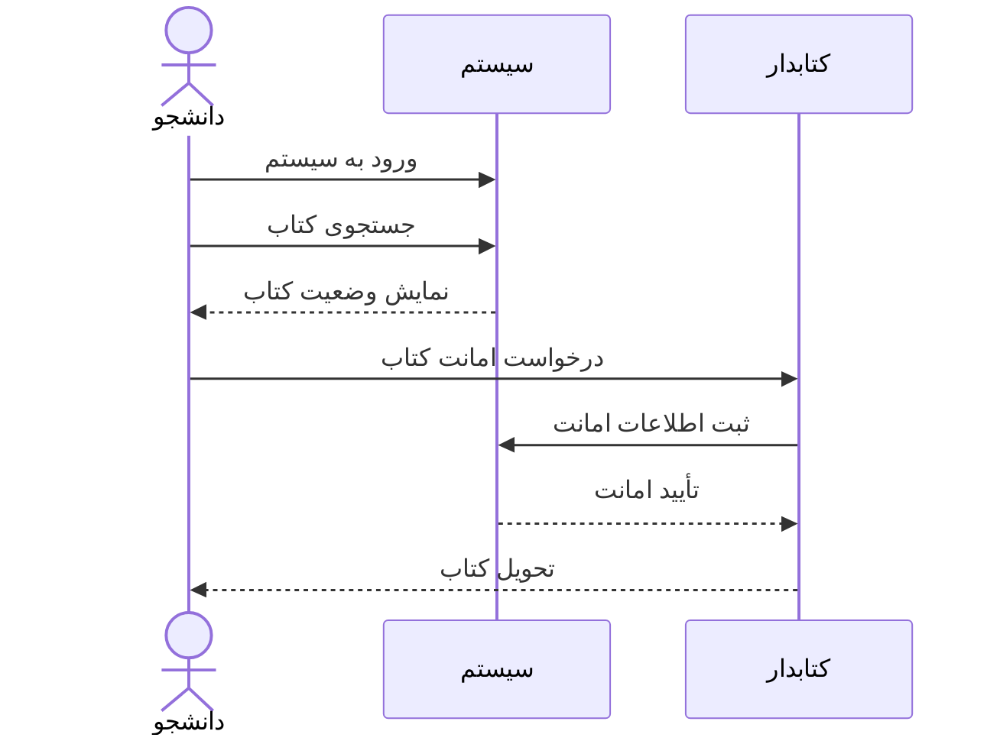

# 📚 سیستم مدیریت کتابخانه دانشگاه

## 🔹 توضیح محیط کاری

سیستم مدیریت کتابخانه برای خودکارسازی فرآیندهای مربوط به امانت و بازگرداندن کتاب‌ها، ثبت‌نام کاربران، جستجوی کتاب‌ها و مدیریت موجودی برای استاد محترم سرکار خانم رمضانیان طراحی شده است.  

### اهداف:
- کاهش خطاهای انسانی  
- سرعت بخشیدن به فرآیند امانت و بازگشت  
- مدیریت بهتر موجودی کتاب‌ها  
- گزارش‌گیری از وضعیت کتابخانه  

### بازیگران اصلی:
- **دانشجو / استاد (کاربر)**  
- **کتابدار**  
- **مدیر سیستم**  

### قابلیت‌های اصلی:
- ثبت‌نام کاربران  
- ورود به سیستم  
- جستجوی کتاب‌ها  
- امانت گرفتن کتاب  
- بازگرداندن کتاب  
- تمدید کتاب  
- مدیریت کتاب‌ها (افزودن / ویرایش / حذف)  
- گزارش‌گیری  

---

## 🔹 نمودار Use Case

> **توضیح:**  
> این نمودار روابط بین بازیگران اصلی سیستم (دانشجو/استاد، کتابدار، مدیر سیستم) و موارد استفاده را نشان می‌دهد.  
> هر بازیگر مشخص می‌کند چه قابلیتی در اختیار دارد و همچنین وابستگی‌هایی مثل نیاز به جستجو قبل از امانت گرفتن کتاب با خط چین نمایش داده شده‌اند.  

---

## 🔹 نمودار کلاس‌ها (Class Diagram)

> **توضیح:**  
> این نمودار ساختار اصلی سیستم را نشان می‌دهد.  
> کلاس‌های اصلی شامل کاربر، دانشجو، کتابدار، مدیر، کتاب و امانت هستند.  
> همچنین روابط بین کلاس‌ها مشخص می‌کند مثلاً هر دانشجو می‌تواند چند امانت داشته باشد یا هر کتابدار مسئول چندین امانت است.  

---

## 🔹 نمودار Sequence (امانت گرفتن کتاب)

> **توضیح:**  
> این نمودار جریان مرحله‌ای فرآیند «امانت گرفتن کتاب» را نمایش می‌دهد.  
> ترتیب تعاملات بین دانشجو، کتابدار و سیستم مشخص است: ورود کاربر، جستجوی کتاب، درخواست امانت، ثبت و تأیید توسط سیستم و در نهایت تحویل کتاب به دانشجو.
