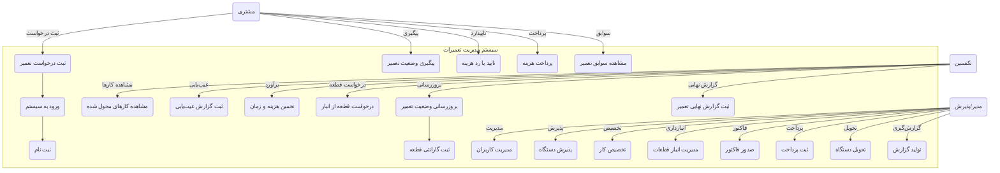

# سیستم مدیریت شرکت تعمیرات الکترونیک

این پروژه یک تحلیل کامل از نیازمندی‌های عملکردی سیستم مدیریت یک شرکت تعمیرات الکترونیک را در قالب نمودار Use Case ارائه می‌دهد.

---

## ۱. بازیگران (Actors)

* **مشتری (Customer):** شخصی که دستگاه الکترونیکی خود را برای تعمیر به شرکت می‌آورد.
* **تکنسین (Technician):** کارشناس فنی که مسئولیت عیب‌یابی، برآورد هزینه و تعمیر دستگاه را بر عهده دارد.
* **مدیر/پذیرش (Admin/Reception):** کاربری که مسئولیت‌های اداری، ارتباط با مشتری، مدیریت انبار و گزارش‌گیری را انجام می‌دهد.

---

## ۲. نمودار Use Case

```mermaid
graph TD;
    subgraph سیستم مدیریت تعمیرات
        direction LR;
        UC1(ثبت درخواست تعمیر);
        UC2(پیگیری وضعیت تعمیر);
        UC3(تایید یا رد هزینه);
        UC4(پرداخت هزینه);
        UC5(مشاهده سوابق تعمیر);
        UC_Login(ورود به سیستم);
        UC_Register(ثبت نام);
        UC6(مدیریت کاربران);
        UC7(پذیرش دستگاه);
        UC8(تخصیص کار);
        UC9(مدیریت انبار قطعات);
        UC10(صدور فاکتور);
        UC11(ثبت پرداخت);
        UC12(تحویل دستگاه);
        UC13(تولید گزارش);
        UC14(مشاهده کارهای محول شده);
        UC15(ثبت گزارش عیب‌یابی);
        UC16(تخمین هزینه و زمان);
        UC17(درخواست قطعه از انبار);
        UC18(بروزرسانی وضعیت تعمیر);
        UC19(ثبت گزارش نهایی تعمیر);
        UC_Warranty(ثبت گارانتی قطعه);
    end;

    Customer(مشتری);
    Admin(مدیر/پذیرش);
    Technician(تکنسین);

    %% Customer Use Cases
    Customer -- "ثبت درخواست" --> UC1;
    Customer -- "پیگیری" --> UC2;
    Customer -- "تایید/رد" --> UC3;
    Customer -- "پرداخت" --> UC4;
    Customer -- "سوابق" --> UC5;

    %% Admin Use Cases
    Admin -- "مدیریت" --> UC6;
    Admin -- "پذیرش" --> UC7;
    Admin -- "تخصیص" --> UC8;
    Admin -- "انبارداری" --> UC9;
    Admin -- "فاکتور" --> UC10;
    Admin -- "پرداخت" --> UC11;
    Admin -- "تحویل" --> UC12;
    Admin -- "گزارش‌گیری" --> UC13;

    %% Technician Use Cases
    Technician -- "مشاهده کارها" --> UC14;
    Technician -- "عیب‌یابی" --> UC15;
    Technician -- "برآورد" --> UC16;
    Technician -- "درخواست قطعه" --> UC17;
    Technician -- "بروزرسانی" --> UC18;
    Technician -- "گزارش نهایی" --> UC19;

    %% Relationships
    UC1 --> UC_Login;
    UC_Login --> UC_Register;
    UC18 --> UC_Warranty;
```

---

## ۳. تشریح کامل Use Caseها

#### **الف) تعاملات مشتری (Customer)**
* **ورود به سیستم (Login):** پیش‌نیاز بسیاری از فعالیت‌های دیگر است.
* **ثبت نام (Register):** قابلیت اختیاری برای کاربرانی که حساب ندارند.
* **ثبت درخواست تعمیر (Submit Repair Request):** مشتری اطلاعات دستگاه و مشکل آن را وارد می‌کند (نیازمند ورود به سیستم است).
* **پیگیری وضعیت تعمیر (Track Repair Status):** مشاهده وضعیت لحظه‌ای دستگاه با کد رهگیری.
* **تایید یا رد هزینه (Approve/Reject Cost):** تصمیم‌گیری در مورد هزینه اعلام شده توسط تکنسین.
* **پرداخت هزینه (Make Payment):** پرداخت آنلاین هزینه تعمیر.
* **مشاهده سوابق تعمیر (View Repair History):** دسترسی به تاریخچه تمام تعمیرات قبلی.

#### **ب) تعاملات مدیر/پذیرش (Admin/Reception)**
* **مدیریت کاربران (Manage Users):** ایجاد، ویرایش و حذف حساب‌های کاربری.
* **پذیرش دستگاه (Device Intake):** ثبت اولیه دستگاه و ارائه کد رهگیری.
* **تخصیص کار (Assign Job):** ارجاع درخواست تعمیر به تکنسین متخصص.
* **مدیریت انبار قطعات (Manage Parts Inventory):** به‌روزرسانی موجودی و مشاهده گزارش انبار.
* **صدور فاکتور (Generate Invoice):** ایجاد فاکتور نهایی برای مشتری.
* **ثبت پرداخت (Log Payment):** ثبت پرداخت‌های نقدی یا تایید پرداخت‌های آنلاین.
* **تحویل دستگاه (Device Handover):** ثبت تحویل دستگاه تعمیر شده به مشتری.
* **تولید گزارش (Generate Reports):** ایجاد گزارش‌های مدیریتی (درآمد، عملکرد و...).

#### **ج) تعاملات تکنسین (Technician)**
* **مشاهده کارهای محول شده (View Assigned Jobs):** مشاهده لیست دستگاه‌های تخصیص‌یافته.
* **ثبت گزارش عیب‌یابی (Log Diagnosis Report):** ثبت جزئیات فنی مشکل دستگاه.
* **تخمین هزینه و زمان (Estimate Cost & Time):** برآورد هزینه و اعلام آن برای تایید مشتری.
* **درخواست قطعه از انبار (Request Part):** درخواست قطعه مورد نیاز از انبار.
* **بروزرسانی وضعیت تعمیر (Update Repair Status):** به‌روز کردن وضعیت فرآیند تعمیر.
* **ثبت گارانتی قطعه (Log Part Warranty):** (اختیاری) ثبت اطلاعات گارانتی برای قطعه تعویضی.
* **ثبت گزارش نهایی تعمیر (Log Final Repair Report):** ثبت گزارش کامل اقدامات انجام شده پس از اتمام کار.
